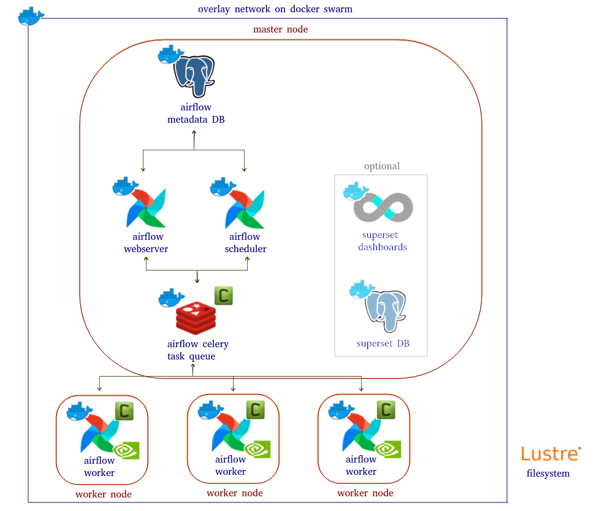

# Airflow stack for pipelines orchestration on a docker swarm 

This implementation was based on puckel's work https://github.com/puckel/docker-airflow


## Overview



## Deployment with workers with GPU

### 1. Make a swarm 

On the master node:  

```
sudo docker swarm init
```

The output should be execute on the worker nodes to join the swarm.  

### 2. Deploy the stack

Run the following on the master node.  

```
sudo docker stack deploy --compose-file docker_stack.yml <name_of_stack>
```

```
sudo docker ps -a
```

### 3. Create airflow user

Put in `script/user.py` youy username, email and password.  
Get name of webserver container and put it on the following line and execute it to make an user.  

```
sudo docker exec -it <web_server_container> python3 /script/user.py
```

### 4. Add worker(s) on nodes with GPU

To add a worker, run the following lines in other nodes with GPU(s) installed, just change the name of the container and network formed by <(name_of_stack)_(network on docker_stack.yml)>

```
dir=<this_directory>
sudo docker container run \
--gpus all \
-e POSTGRES_USER=airflow \
-e POSTGRES_PASSWORD=airflow \
-e POSTGRES_DB=airflow \
-e POSTGRES_HOST=afpostgres \
-e FERNET_KEY=46BKJoQYlPPOexq0OhDZnIlNepKFf87WFwLbfzqDDho= \
-e EXECUTOR=Celery \
-v $dir/dags:/usr/local/airflow/dags \
-v $dir/plugins:/usr/local/airflow/plugins \
-v $dir/change_config.txt:/script/change_config.txt \
-v $dir/requirements.txt:/script/requirements.txt \
-v $dir/data:/usr/local/airflow/data \
-v $dir/data/results:/usr/local/airflow/results \
-v $dir/logs:/usr/local/airflow/logs \
-p 6006:6006 \
--network <name_of_network> \
--name <name_of_container> \
-dit orchest/airflow-tf-docker1-15:v1 worker
```

### Note

If you deploy the stack with extras (included superset) use docker_stack_extras.yml and once you deploy the stack run the following to initialize the db. Do not forget to modify script/db_init.sh for your purpose.  

```
sudo docker exec -it <sspostgres_container> /bin/bash /db_init.sh
```

Initialize superset.  

```
sudo docker exec -it <superset_container> /bin/bash /etc/superset/superset_init.sh
```
